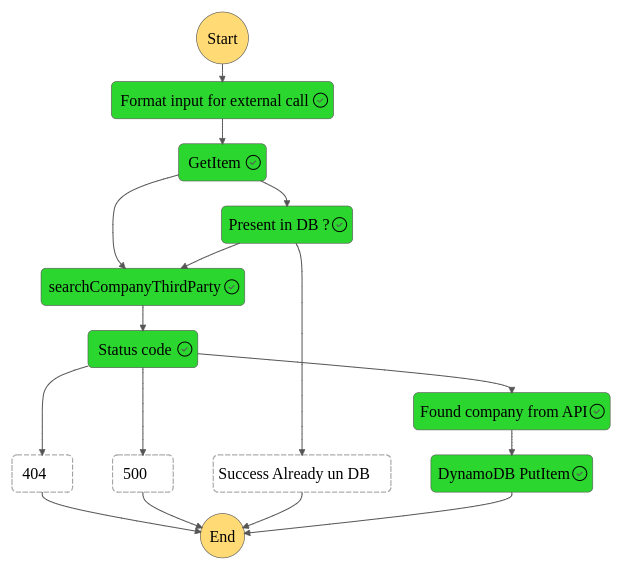

# serverless_step_function
Example of stepFunction

## what are step function ?
Step function is a serverless service provided by AWS.
Which give the possibility to code a state machine.  
So a business logic with if / else branching logic.  
And a way to visualize into AWS the path of a particular request. 

## Let's see an example

Use case:  

Imagine you have a client.  
This client wants details about a company for example.  
He sends company name to the step function
- First sanity checks
- Does the corresponding company exist in DB ?
    - if Yes then Success Already in DB
    - if No Launch an external third party API call
        - happy path : Found the item from the external system
            - insert it in your DB
        - not happy path: deal with http error codes (404, 500, ...)

Notes:   
This project was realized with the help of Amplify AWS service.  
Amplify is being refactored by the AWS teams, and reoriented toward a much higher frontend integration with ... javascript.   
I developed my frontend with ... kotlin

So end of story

It was nice trying this AWS service.

